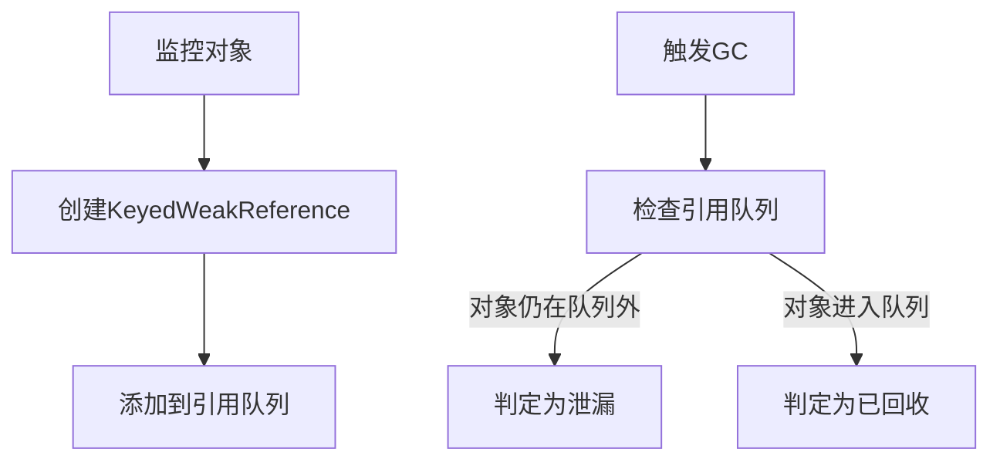

# Android热门依赖库知识点总结
## 官方组件
### ViewModel & Lifecycle
#### onSaveInstanceState 存储数据原理
onSaveInstanceState 是 Android 中用于临时保存 Activity 或 Fragment 状态的重要机制，主要用于应对**系统配置变更(如屏幕旋转)或系统资源回收**等情况。
* 当 Activity 可能被销毁时(如配置变更或后台回收)，系统会调用 onSaveInstanceState(Bundle outState)
* 开发者可以重写此方法，将需要保存的状态数据存入提供的 Bundle 对象
* 当 Activity 重新创建时，系统会将保存的 Bundle 传递给 onCreate(Bundle savedInstanceState) 或 onRestoreInstanceState(Bundle savedInstanceState)
* 内部使用 ArrayMap 实现键值存储，支持基本数据类型、String、Parcelable 和 Serializable 对象，数据会被序列化为字节流
* 系统使用 Binder 事务缓冲区传输这些数据(大小限制约1MB)
* 数据临时保存在系统进程中，不是持久化存储，进程终止后数据会丢失
* onSaveInstanceState 被调用的频率可能增加

#### ViewModel 存数据的原理
ViewModel 是 Android Jetpack 架构组件的一部分，它能在配置变更（如屏幕旋转）时保留数据，但在应用进程被完全终止时数据会丢失。
* 每个 Activity/Fragment 拥有一个 ViewModelStore 实例
* ViewModelStore 内部使用 HashMap 存储 ViewModel 实例
* 配置变更时，ViewModelStore 被保留在内存中
* ViewModel 的生命周期比创建它的 Activity/Fragment 更长
* 当 Activity 因配置变更销毁重建时，ViewModel 不会被清除，当 Activity 真正完成（finish()）时，ViewModel 会被清除

底层实现原理
ViewModelProvider 工作机制：
```java
// 获取 ViewModel 的简化流程
ViewModelProvider(owner).get(MyViewModel::class.java)

// 内部实现关键步骤：
1. 检查 owner（Activity/Fragment）的 ViewModelStore
2. 如果不存在对应 ViewModel 实例，则通过 Factory 创建新实例
3. 将新实例存入 ViewModelStore 的 HashMap
```

#### 配置变更可以保存数据原理
配置变更场景：
* 当 Activity 因配置变更被销毁时，系统保留了一个特殊的"非配置实例"
* 这个非配置实例持有 ViewModelStore
* 新创建的 Activity 实例会获取前一个实例的 ViewModelStore

#### ViewModeProvider 的作用
* 负责实例化 ViewModel 对象
* 确保不会重复创建相同的 ViewModel 实例
* 将 ViewModel 与特定的 Activity/Fragment 生命周期关联
* 确保 ViewModel 在配置变更时不会被销毁
* 与 ViewModelStore 协作管理 ViewModel 实例的存储

#### ViewModel 的工厂模式(ViewModelProvider.Factory)有什么作用
ViewModelProvider.Factory 是 ViewModelProvider 的工厂接口，用于创建 ViewModel 实例。
* 当 ViewModelProvider 找不到已存在的 ViewModel 实例时，会调用 Factory 的 create 方法创建新实例
* 可以通过实现 Factory 接口，根据不同的构造参数创建不同的 ViewModel 实例
* 可以通过依赖注入框架（如 Dagger、Hilt）来提供 Factory 的实现，实现 ViewModel 的依赖注入
* 可以通过自定义的 ViewModelFactory 来实现不同的 ViewModel 实例创建逻辑，如根据不同的参数创建不同的 ViewModel 实例

#### Lifecycle 工作机制
Lifecycle 是 Android Jetpack 架构组件的一部分，用于管理 Activity 和 Fragment 的生命周期。
* 每个 Activity/Fragment 都有一个 LifecycleRegistry 实例
* LifecycleRegistry 内部维护了一个 LifecycleOwner 和 Lifecycle 的对应关系
* 当 Activity/Fragment 生命周期状态改变时，LifecycleRegistry 会通知所有的 LifecycleObserver
* LifecycleObserver 可以通过注解或手动注册来监听特定的生命周期事件

底层实现原理
LifecycleRegistry 工作机制：
```java
// 生命周期状态变化时的简化流程
1. 调用 LifecycleRegistry.markState(Lifecycle.State.CREATED)
2. 遍历所有 LifecycleObserver，调用其对应的生命周期方法（如 onStart()）

// 内部实现关键步骤：
1. 维护一个 LifecycleOwner 和 Lifecycle 的对应关系
2. 当 LifecycleOwner 生命周期状态改变时，遍历所有 LifecycleObserver，调用其对应的生命周期方法
```

#### ViewModel如何感知生命周期
ViewModel 的生命周期感知主要依赖于以下组件协作：
* ViewModelStoreOwner：Activity/Fragment 实现的接口，提供 ViewModelStore
* ViewModelStore：实际存储 ViewModel 实例的容器
* LifecycleOwner：Activity/Fragment 提供的生命周期来源

#### Fragment共享viewmodel
Fragment 间共享数据, 实际使用中，可以通过以下方式来实现：
```kotlin
// 多个 Fragment 通过 activity 获取同一个 ViewModel
val sharedViewModel = ViewModelProvider(requireActivity()).get(SharedViewModel::class.java)
```

### LiveData & Flow
#### 什么是 LiveData？它的主要特点是什么？
* LiveData 是一种可观察的数据持有者类，具有生命周期感知能力
* 特点：生命周期感知、自动更新UI、避免内存泄漏、数据始终保持最新状态

#### LiveData 与 RxJava/Observable 有什么区别？
* LiveData 是生命周期感知的，专为 Android 设计
* RxJava 更强大但更复杂，需要手动管理订阅生命周期
* LiveData 自动处理订阅和取消订阅

#### LiveData 的生命周期感知是如何实现的？
* 通过 LifecycleOwner 关联组件生命周期
* 在 STARTED 或 RESUMED 状态时激活观察者
* 在 DESTROYED 状态时自动移除观察者

#### LiveData 的观察者模式是如何工作的？
* 使用 Observer 接口注册观察者
* 数据变化时通知处于活跃状态的观察者
* 新观察者注册时会立即收到当前值

#### LiveData 的 setValue() 和 postValue() 有什么区别？
* setValue() 必须在主线程调用
* postValue() 可以在后台线程调用，内部会切换到主线程

#### LiveData 如何保证数据不丢失？
* 新观察者注册时会立即收到最后一次的数据
* 配置更改时不会丢失数据(与 ViewModel 配合)

#### 如何合并多个 LiveData 源？
* 使用 MediatorLiveData 可以观察多个 LiveData 源
* 将多个源添加为 MediatorLiveData 的源

#### 在 Repository 层应该返回 LiveData 吗？
* 不建议，Repository 应保持框架无关性
* 建议返回 suspend 函数或 Flow，由 ViewModel 转换为 LiveData

#### LiveData 在 View 和 ViewModel 之间如何分工？
* ViewModel 暴露 LiveData
* View(Activity/Fragment) 观察 LiveData 并更新UI
* 业务逻辑应放在 ViewModel 中

#### LiveData 与数据绑定(Data Binding)如何配合？
* 直接在布局文件中绑定 LiveData
* 需要设置生命周期所有者 binding.lifecycleOwner = this

#### LiveData 与 StateFlow/SharedFlow 如何选择？
* LiveData 适合 Android UI 层，简单场景
* StateFlow/SharedFlow 适合复杂数据流，跨平台逻辑层
* LiveData 自动生命周期感知，Flow 需要手动收集

### Room

### Navigation

### DataStore & SharedPreferences & MMKV
#### SP
通过xml文件存储。
优点:
* Android 原生支持，无需额外依赖
* 简单易用，API 直观
* 适合存储少量简单数据（键值对）

缺点:
* 同步API，可能导致主线程阻塞
* 不支持跨进程
* 没有类型安全
* 性能较差，特别是大数据量时
* 不支持异常处理，可能丢失数据
* 全量写入，即使只修改一个值也要重写整个文件

#### DataStore
Google推荐的替代SharedPreferences的方案。
* 异步API（基于Kotlin协程/Flow）
* 类型安全（通过Protobuf）
* 更好的错误处理机制
* 不会阻塞UI线程
* 支持数据一致性保证

#### MMKV
腾讯开源的高性能KV存储框架。
* 基于内存映射，读写速度快
* 支持多种加密方式
* 支持多进程
* 自动增量更新，效率高
* 支持加密
* 支持多种数据类型
* 微信团队开发，经过大规模验证

##### 内存映射技术
内存映射技术是一种**将文件内容映射到内存中**的技术。
* 内存映射允许应用程序直接读写文件内容，而无需通过传统的文件读写操作
* 内存映射减少了文件读写的系统调用次数，提高了读写效率
* 内存映射将文件内容映射到内存中，减少了数据的拷贝操作，提高了数据访问速度

### Lottie
* Lottie 通过 Android 的 Canvas API 逐帧绘制矢量图形
* 利用 View 的硬件加速层（通过 setLayerType(LAYER_TYPE_HARDWARE, null)）提升性能
* ValueAnimator：核心动画引擎，根据时间插值计算动画进度
* JSONObject/JSONArray：解析 After Effects 导出的动画 JSON 文件
* 对包含位图资源的动画，使用 BitmapFactory 解码
* 在后台线程（通过 HandlerThread）解析动画 JSON 避免主线程阻塞，通过 Handler 将渲染结果同步到 UI 线程
* 使用 LruCache 缓存常用动画，避免重复解析
* 对非活跃动画采用弱引用策略减少内存占用

### ViewBinding & DataBinding
ViewBinding 是 Android 官方提供的一种类型安全的视图绑定机制，它通过在编译时生成绑定类来替代传统的 findViewById() 方法。

Android Gradle 插件会：
* 解析布局XML文件：处理所有包含 `merge` 或根标签的布局文件
* 生成绑定类：为每个布局文件生成对应的绑定类（如 ActivityMainBinding）
* 优化代码：移除未使用的绑定引用

运行时工作流程：
* 调用生成的 inflate() 方法
* 内部使用 LayoutInflater 加载布局
* 调用 bind() 方法进行视图绑定
* 对布局中的每个带有ID的视图执行一次 findViewById()
* 将找到的视图引用保存在绑定类的字段中
* 返回绑定类实例

优点：
* 类型安全：绑定类中包含所有视图的强类型引用
* 内部有缓存机制，避免重复查找
* 避免了 findViewById() 的调用，提高了性能
* 简化了代码编写，减少了错误

缺点：
* 编译时生成绑定类，可能会增加 APK 大小
* 对于复杂布局，可能会导致生成的绑定类过于庞大

DataBinding 是 Android 官方提供的数据绑定框架，它允许开发者以声明式方式将布局与数据源绑定，自动同步 UI 和数据变化。

编译过程会执行以下操作：
* 布局文件预处理，解析所有包含 `layout` 标签的 XML 文件.
* 将普通布局转换为 DataBinding 专用格式（添加绑定桥梁）
* 生成 BR 类（类似 R 类，用于绑定资源）
*  为每个绑定布局生成对应的绑定类（如 ActivityMainBindingImpl）
* 生成 ViewDataBinding 的子类
* 实现观察者模式和绑定逻辑

双向绑定实现：
```xml
<EditText android:text="@={user.name}"/>
```

* 设置文本变化监听器
* 数据变化时更新UI
* UI变化时更新数据源

### ViewPager2

### Gson & Moshi & KotlinX Serialization

### Proguard

### Jetpack Compose

## 三方组件
### RecyclerView
#### 用途
* 大数据集合展示： RecyclerView适用于展示大量数据，通过ViewHolder的复用机制减少内存消耗。
* 复杂布局： 支持不同的LayoutManager，可以实现线性、网格、瀑布流等多种复杂布局。
* 滑动性能优化： 通过异步加载和局部刷新等手段，提升滑动的流畅度。

#### 核心组件
* Recycler：是构建自定义的布局管理器的核心帮助类，几乎干了所有的获取视图、缓存视图等和回收相关的活动。能让RecyclerView能快速的获取一个新视图来填充数据或者快速丢弃不再需要的视图。
* Adapter：是所有数据的来源，负责提供数据并创建ViewHolders以及将数据绑定到ViewHolders上的重要组件，可以视为是recycler对外的工作的对接者
* ViewHolder：存取状态信息，在recycler内部也对viewHolder进行了状态信息的存取（是否正在被改变，是否被删除或添加）
* LayoutManager：决定RecyclerView中Items的排列方式，包含了Item View的获取与回收；当数据集发生变化时，LayoutManager会自动调整子view的位置和大小，以保证RecyclerView的正常显示和性能。

#### RecyclerView的View缓存机制
* ViewHolder模式： RecyclerView使用ViewHolder模式来缓存视图。当ItemView滑出屏幕时，对应的ViewHolder会被缓存，而不是立即销毁。当需要新的ItemView时，可以从缓存中获取ViewHolder，避免频繁的View创建和销毁。
* Recycler池： RecyclerView通过Recycler池来管理缓存的ViewHolder。Recycler池中维护了一个可回收的ViewHolder队列，通过这个池来快速获取可重用的ViewHolder。
* 复用机制： 当新的数据需要显示时，RecyclerView会调用Adapter的onBindViewHolder方法，将新的数据绑定到已存在的ViewHolder上，而不是创建新的View。
* Scrap缓存： 在RecyclerView内部还有一个Scrap缓存，用于存储一些没有被完全废弃的ItemViews。这个缓存用于快速重用视图，减少了ViewHolder的创建和初始化时间。

### Retrofit + Okhttp
#### Retrofit的设计模式
#### 动态代理机制
核心流程：
```java
public <T> T create(final Class<T> service) {
    return (T) Proxy.newProxyInstance(
        service.getClassLoader(),
        new Class<?>[] { service },
        new InvocationHandler() {
            @Override public Object invoke(Object proxy, Method method, Object[] args) {
                // 将接口方法转换为HTTP请求
                return loadServiceMethod(method).invoke(args);
            }
        });
}
```

* 通过Java动态代理技术生成API接口的实现
* 方法调用时，将注解配置转换为HTTP请求参数
* 最终通过OkHttp执行实际网络请求

##### 建造者模式 (Builder Pattern)
应用场景：Retrofit 实例的配置和创建

典型实现：
```java
Retrofit retrofit = new Retrofit.Builder()
    .baseUrl("https://api.example.com/")
    .addConverterFactory(GsonConverterFactory.create())
    .addCallAdapterFactory(RxJava2CallAdapterFactory.create())
    .client(okHttpClient)
    .build();
```

优势：
* 支持链式调用，配置灵活
* 隔离复杂对象的创建过程
* 保证构建过程的一致性

##### 适配器模式 (Adapter Pattern)
应用场景：Call 到其他类型的转换

核心组件：
```
CallAdapter.Factory：适配器工厂基类

RxJavaCallAdapterFactory：将 Call 适配为 RxJava 的 Observable

CoroutineCallAdapterFactory：将 Call 适配为 Kotlin 协程的 suspend 函数
```

工作流程：
```
OkHttpCall --> CallAdapter.adapt() --> Observable/SuspendFunction/其他类型
```
##### 工厂方法模式 (Factory Method Pattern)
应用场景：Converter 和 CallAdapter 的创建

实现示例：
```java
public interface Converter.Factory {
    // 根据类型创建转换器
    Converter<ResponseBody, ?> responseBodyConverter(
        Type type, Annotation[] annotations, Retrofit retrofit);
    
    // 根据类型创建请求体转换器
    Converter<?, RequestBody> requestBodyConverter(
        Type type, Annotation[] annotations, Retrofit retrofit);
}
```

派生工厂：
```
GsonConverterFactory
MoshiConverterFactory
ScalarsConverterFactory
```

##### 装饰者模式 (Decorator Pattern)
应用场景：OkHttpCall 的封装

实现方式：
```java
final class OkHttpCall<T> implements Call<T> {
    private final ServiceMethod<T, ?> serviceMethod;
    private final @Nullable Object[] args;
    
    // 装饰原始的OkHttp Call
    private @Nullable okhttp3.Call rawCall;
}
```

作用：
* 在不改变原有 Call 接口的情况下增强功能
* 添加了缓存、线程切换等附加功能

##### 策略模式 (Strategy Pattern)
应用场景：HTTP 请求方法的处理

实现体现：
* 每个 HTTP 注解（@GET/@POST 等）对应不同的请求策略
* RequestBuilder 根据注解选择不同的参数处理方式

示例：
```java
void parseMethodAnnotation(Annotation annotation) {
    if (annotation instanceof GET) {
        parseHttpMethodAndPath("GET", ((GET) annotation).value());
    } else if (annotation instanceof POST) {
        parseHttpMethodAndPath("POST", ((POST) annotation).value());
    }
    // 其他HTTP方法...
}
```

##### 观察者模式 (Observer Pattern)
应用场景：通过 Callback 处理异步响应

典型实现：
```java
call.enqueue(new Callback<User>() {
    @Override public void onResponse(Call<User> call, Response<User> response) {
        // 成功回调
    }
    
    @Override public void onFailure(Call<User> call, Throwable t) {
        // 失败回调
    }
});
```

#####  责任链模式 (Chain of Responsibility)
应用场景：OkHttp 的拦截器体系

Retrofit 中的集成：
```java
OkHttpClient client = new OkHttpClient.Builder()
    .addInterceptor(new LoggingInterceptor())
    .addNetworkInterceptor(new StethoInterceptor())
    .build();
```

处理流程：
```
请求 → 拦截器1 → 拦截器2 → ... → 拦截器N → 服务器
响应 ← 拦截器N ← ... ← 拦截器2 ← 拦截器1 ← 
```

设计模式综合应用示例
```java
// 建造者模式创建Retrofit实例
Retrofit retrofit = new Retrofit.Builder()
    .baseUrl(BASE_URL)
    .client(new OkHttpClient.Builder() // 装饰者模式增强OkHttpClient
        .addInterceptor(new HttpLoggingInterceptor()) // 责任链模式
        .build())
    .addConverterFactory(new GsonConverterFactory()) // 工厂方法模式
    .build();

// 动态代理模式创建API实例
GitHubService service = retrofit.create(GitHubService.class);

// 适配器模式将Call转换为RxJava Observable
Observable<List<Repo>> observable = service.listRepos("user");

// 观察者模式处理响应
observable.subscribe(new Observer<List<Repo>>() {
    @Override public void onSubscribe(Disposable d) {}
    
    @Override public void onNext(List<Repo> repos) {
        // 处理数据
    }
    
    @Override public void onError(Throwable e) {
        // 错误处理
    }
});
```

Retrofit 通过精心组合这些经典设计模式，实现了简单易用与强大功能之间的完美平衡，成为 Android 网络请求的事实标准。理解这些设计模式有助于开发者更好地使用和扩展 Retrofit。

##### OKhttp的优势
* 拦截器机制： OkHttp通过拦截器链来处理请求和响应。每个拦截器可以在请求或响应被处理前或后进行自定义操作。
* 连接池： OkHttp使用连接池来管理HTTP连接，减少了创建和销毁连接的开销。
* 缓存机制： OkHttp支持缓存机制，通过缓存策略来控制是否使用缓存。
* 异步请求： OkHttp支持异步请求，通过回调或协程来处理请求结果。
* 支持HTTPS： OkHttp支持HTTPS协议，通过SSL/TLS加密来保护数据安全。
* 支持GZIP压缩： OkHttp支持GZIP压缩，通过压缩请求和响应数据来减少网络传输的数据量。

#### HTTP 和 HTTPS 的区别？HTTPS 的加密流程？

### Ktor
Ktor 是 JetBrains 推出的异步网络框架，支持全栈开发（客户端+服务端），基于 Kotlin 协程设计，**100% Kotlin 原生支持**。而且随着KMP技术发展，Ktor也已经支持跨平台网络请求。

核心特性：
* 协程优先：所有API设计为挂起函数
* 轻量级：模块化设计，按需引入组件
* 多平台支持：Android、iOS、JVM、JavaScript、Native
* 插件化架构：通过安装(install)功能扩展能力

和Retrofit对比
* 协程支持：Ktor 支持 Kotlin 协程，简化异步编程
* 功能丰富：Ktor 提供了更多的功能，如文件上传、WebSocket、服务器端渲染等
* 跨平台支持：Ktor 支持跨平台开发，如 Android、iOS、JVM、JavaScript、Native
* 社区活跃：Ktor 社区活跃，有丰富的文档和示例

#### CIO引擎
对比OkHttp：

| 特性	| CIO 引擎 |	OkHttp 引擎|
|:----|:----|:----|
|实现语言 |	100% Kotlin	| Java + Kotlin|
| 线程模型|	协程事件循环|	线程池 + NIO|
|内存占用|	更低 (~1/3 of OkHttp)|	较高|
|HTTP/2支持 |	需要手动启用	| 默认支持|
|WebSocket |	基础支持	| 更成熟实现|
|平台支持	| 全平台 (包括Native)	| 仅JVM/Android|
|DNS解析 |	纯Kotlin实现	|依赖系统实现|

### Hilt & Dagger & Koin 依赖导入
#### 依赖注入
依赖注入是一种设计模式，用于将对象的依赖从内部移到外部进行管理。它的主要好处包括：

解耦代码：通过接口或抽象类注入依赖，降低模块之间的耦合度。
提升测试性：可以使用 Mock 对象注入，方便单元测试。
易于维护：通过集中管理依赖关系，减少手动创建对象的复杂性。

#### 三者简介
* Dagger是一个用于管理依赖注入的框架，它通过编译时生成代码来实现依赖注入。
* Hilt是一个用于简化Android依赖注入的框架，它基于Dagger，并提供了一些额外的功能，如简化依赖注入的配置。
* Koin是一个轻量级的依赖注入框架，它支持Kotlin语言，并提供了一些额外的功能，如简化依赖注入的配置。

#### 写法举例
Dagger
```kotlin
@Module
class NetworkModule {
    @Provides
    fun provideOkHttp(): OkHttpClient = OkHttpClient.Builder().build()
}

@Component(modules = [NetworkModule::class])
interface AppComponent {
    fun inject(activity: MainActivity)
}

// 在Application中初始化
class MyApp : Application() {
    val appComponent = DaggerAppComponent.create()
}
```

Hilt
```kotlin@Module
@InstallIn(SingletonComponent::class)
object NetworkModule {
    @Provides
    @Singleton
    fun provideOkHttp(): OkHttpClient = OkHttpClient.Builder().build()
}

@AndroidEntryPoint
class MainActivity : AppCompatActivity() {
    @Inject lateinit var okHttpClient: OkHttpClient
}

// Application类需添加注解
@HiltAndroidApp
class MyApp : Application()
```

Koin
```kotlin
val appModule = module {
    single { OkHttpClient.Builder().build() }
}

class MyApp : Application() {
    override fun onCreate() {
        super.onCreate()
        startKoin {
            androidContext(this@MyApp)
            modules(appModule)
        }
    }
}

class MainActivity : AppCompatActivity() {
    private val okHttpClient: OkHttpClient by inject()
}
```

#### 对比表格

| 概念 | Dagger 2 | Hilt | Koin | 
|:----|:----|:----|:----| 
| 工作原理 | 编译时代码生成 | 基于Dagger的预配置Android方案 | 运行时依赖解析 | 
| 配置方式 | 手动创建Component/Module | 注解驱动+预定义Android组件 | DSL声明式配置 | 
| 编译时间影响 | 显著（需kapt处理） | 显著（继承自Dagger） | 无 | 
| 运行时性能 | 最佳（编译期解决依赖） | 同Dagger | 轻微开销（运行时解析） |

### Glide & Coil

### RxJava

### EventBus

### LeakCanary 
LeakCanary 是 Square 公司开发的一款 Android 内存泄漏检测工具，它能够自动检测应用中的内存泄漏并生成详细的泄漏轨迹报告。

* LeakCanary 基于 Java 的 WeakReference（弱引用） 和 ReferenceQueue（引用队列） 机制

工作原理流程图:


LeakCanary 默认监控以下Android组件：
* 销毁的Activity
* 销毁的Fragment
* 销毁的View
* 销毁的ViewModel

#### 泄漏检测触发时机
* Activity/Fragment销毁时：通过注册 Application.ActivityLifecycleCallbacks
* View/ViewModel销毁时：通过各自的销毁回调
* 手动监控：AppWatcher.objectWatcher.watch(myObject)

#### 泄漏分析过程
* 当检测到可能的内存泄漏时，调用 Debug.dumpHprofData() 生成堆转储文件
* 使用 Shark 解析器分析堆转储（替代旧版HAHA）
* 查找泄漏对象的引用链
* 识别最短强引用路径（从GC Roots到泄漏对象）
* 排除系统类引用（过滤噪声）

#### 核心优化技术
1. 性能优化措施
* 延迟检测：默认5秒后执行检测（等待主线程空闲）
* 采样分析：在Debug版本中全量分析，Release版本抽样
* 后台线程：所有分析操作在独立线程执行

2. 准确性保障
* 多次GC验证：确保对象真的无法被回收
* 引用链验证：确认泄漏路径的有效性
* 排除软/弱引用：只关注强引用泄漏

常见泄漏场景处理：
* 单例持有Context：改用Application Context
* Handler内存泄漏：使用静态Handler+WeakReference
* 匿名内部类持有：改为静态内部类

LeakCanary 通过巧妙的弱引用监控和堆转储分析技术，为Android开发者提供了简单高效的内存泄漏检测方案，极大提升了内存问题排查效率。
## Kotlin
### lateinit 和 by lazy 的区别
lateinit（延迟初始化）
* 用于可变的 var 属性
* 必须显式初始化后才能访问
* 不能用于基本数据类型（Int, Boolean等）
* 编译时不检查初始化状态，运行时检查

by lazy（延迟加载）
* 用于不可变的 val 属性
* 首次访问时自动初始化
* 可以配置属性，自定义初始化逻辑
* 可以用于基本数据类型

### 实现原理
lateinit
* 编译时生成额外代码
* 获取时，自动检查初始化状态
* 生成一个访问器方法，用于获取属性

by lazy
* 使用委托模式
* 内部维护初始化状态和值
* 首次访问时，生成一个访问器方法
* 该方法内部使用 synchronized 确保线程安全
* 可以配置为非线程安全模式，提升速度

### 协程
见更全面的总结文章：
[Kotlin协程浅谈](./2025-2-23-Kotlin协程浅谈.md)

### apply & with & let & run
Kotlin 提供了几个强大的作用域函数（scope functions），它们都用于在对象的上下文中执行代码块，但在使用方式和场景上有所不同。

| 函数	| 上下文对象引用	| 返回值	| 是否扩展函数	| 典型使用场景	|
|:----|:----|:----|:----|:----|
| let	| it	| Lambda 结果	| 是	| 非空对象处理、链式操作	|
| run	| this	| Lambda 结果	| 是	| 对象配置、计算返回值	|
| with	| this	| Lambda 结果	| 否	| 对象分组操作	|
| apply	| this	| 对象本身	| 是	| 对象初始化	|
| also	| it	| 对象本身	| 是	| 附加效果、日志记录	|

#### let
```kotlin
// 安全调用非空对象
val length = nullableString?.let { 
    println("Processing: $it")
    it.length  // 返回值
} ?: 0

// 链式操作
user?.let { it.copy(name = "NewName") }?.let(::print)
```

* 通过 it 引用对象
* 返回 lambda 表达式结果
* 常用于空安全检查

#### run
```kotlin
val result = service.run {
    port = 8080  // 直接访问属性
    query()      // 直接调用方法
    // 最后一行作为返回值
}

// 替代构造器模式
val rectangle = Rectangle().run {
    width = 10
    height = 20
    area()  // 返回面积
}
```

* 通过 this 引用对象（可省略）
* 返回 lambda 表达式结果
* 适合对象转换和计算

#### with
```kotlin
val output = with(StringBuilder()) {
    append("Hello")
    append(" ")
    append("World")
    toString()  // 返回结果
}
```

* 非扩展函数
* 通过 this 引用对象
* 返回 lambda 表达式结果
* 适合对同一对象进行多次操作

#### apply
```kotlin
val myView = TextView(context).apply {
    text = "Hello"
    textSize = 16f
    setPadding(10, 0, 10, 0)
    // 返回TextView对象本身
}

// 替代Builder模式
val intent = Intent().apply {
    action = "ACTION_VIEW"
    data = Uri.parse("https://kotlinlang.org")
}
```

* 通过 this 引用对象
* 返回对象本身
* 主要用于对象初始化

#### also
```kotlin
val numbers = mutableListOf(1, 2, 3).also {
    println("Before adding: $it")
    it.add(4)
}.also {
    println("After adding: $it")
}
```

* 通过 it 引用对象
* 返回对象本身
* 适合执行附加操作

### 数据类
Kotlin编译时移动生成了hashcode equals toString copy等方法。

底层实现：编译器生成的数据类大致如下：
```java
public final class User {
    private final String name;
    private final int age;

    public User(String name, int age) {
        this.name = name;
        this.age = age;
    }

    @Override
    public boolean equals(Object o) {
        if (this == o) return true;
        if (o == null || getClass() != o.getClass()) return false;
        User user = (User) o;
        return age == user.age && name.equals(user.name);
    }

    @Override
    public int hashCode() {
        return Objects.hash(name, age);
    }

    @Override
    public String toString() {
        return "User{name='" + name + "', age=" + age + "}";
    }

    public User copy(String name, int age) {
        return new User(name, age);
    }

    public String component1() {
        return name;
    }

    public int component2() {
        return age;
    }
}
```

* 附加功能：数据类支持解构声明，可以将对象的属性直接解构到多个变量中。

### 扩展函数原理
Kotlin 允许你为现有类添加新功能，而不需要继承这个类或使用装饰者模式。通过扩展函数，你可以直接在类外部为它添加新方法。
示例：
```kotlin
fun String.hello() = "Hello, $this"
println("World".hello())  // 输出: Hello, World
```

解析：
* 简化的语法：扩展函数可以让你对现有类添加自定义功能，而无需修改类的定义。比如上例中的hello()函数，并不是String类的内置方法，但你可以像调用内置方法一样使用它。
* 底层实现：扩展函数在编译时被转换为静态方法，类的实例作为第一个参数传递。

```java
public static String hello(String receiver) {
     return "Hello, " + receiver;
}
```

### Lambda
* 简化的语法：Lambda 表达式是一种简洁的函数表示形式，可以用更少的代码来表达相同的逻辑。它在 Kotlin 中被广泛用于集合操作、异步编程等场景。
* 底层实现：Lambda 表达式在编译时被转换为匿名函数类的实例。Kotlin 提供了一组函数接口，如 Function1、Function2，分别表示接受 1 个参数、2 个参数的函数。
```java
Function2<Integer, Integer, Integer> sum = new Function2<Integer, Integer, Integer>() {
    @Override
    public Integer invoke(Integer a, Integer b) {
        return a + b;
    }
};
int result = sum.invoke(1, 2);
```

* 捕获变量：如果 Lambda 表达式在定义时捕获了外部变量，那么编译器会生成一个闭包类来封装这些变量。

### When关键字
* 简化的语法：when 表达式比传统的 switch 语句更强大，它不仅可以匹配值，还可以匹配条件，甚至使用复杂的表达式。此外，它也可以返回一个结果。
* 底层实现：编译器会将 when 表达式转换为一系列条件检查（if-else 语句），或者在可能的情况下转换为 Java 字节码中的 switch 语句。

```java
val result = when (x) {
    1 -> "One"
    2 -> "Two"
    else -> "Unknown"
}

String result;
if (x == 1) {
    result = "One";
} else if (x == 2) {
    result = "Two";
} else {
    result = "Unknown";
}
```

### ?空安全
转换成Java实际就是一个null检查，如何配合?:操作符，就是三目运算符后面赋一个默认值

### 委托
在 Kotlin 中，委托（Delegation） 是一种强大的设计模式，它允许对象将部分功能委托给另一个辅助对象来实现。Kotlin 原生支持多种委托方式，主要分为以下几种：
1. 类委托（Class Delegation）
通过 by 关键字，将类的接口实现委托给另一个对象，常用于 "装饰器模式" 或 "代理模式"。

示例：委托接口实现
```kotlin
interface Printer {
    fun print(message: String)
}

class DefaultPrinter : Printer {
    override fun print(message: String) {
        println("Default Printer: $message")
    }
}

// 委托给 printer 对象
class CustomPrinter(private val printer: Printer) : Printer by printer {
    // 可以覆盖部分方法
    override fun print(message: String) {
        println("Before Printing...")
        printer.print(message) // 调用委托对象的方法
        println("After Printing...")
    }
}

fun main() {
    val defaultPrinter = DefaultPrinter()
    val customPrinter = CustomPrinter(defaultPrinter)
    customPrinter.print("Hello, Kotlin!")
}
```

输出：
Before Printing...
Default Printer: Hello, Kotlin!
After Printing...

适用场景：
* 增强或修改现有类的行为（如日志、缓存、权限控制）。
* 避免继承，使用组合代替。

2. 属性委托（Property Delegation）
Kotlin 提供标准库委托（如 lazy、observable），也可以自定义委托。

(1) lazy 延迟初始化
```kotlin
val lazyValue: String by lazy {
    println("Computed only once!")
    "Hello"
}

fun main() {
    println(lazyValue) // 第一次访问时计算
    println(lazyValue) // 直接返回缓存值
}
```

输出：
Computed only once!
Hello
Hello

(2) observable 监听属性变化
```kotlin
import kotlin.properties.Delegates

var observedValue: Int by Delegates.observable(0) { _, old, new ->
    println("Value changed from $old to $new")
}

fun main() {
    observedValue = 10  // 触发回调
    observedValue = 20  // 再次触发
}
```

输出：
Value changed from 0 to 10
Value changed from 10 to 20

(3) vetoable 可拦截修改
```kotlin
var positiveNumber: Int by Delegates.vetoable(0) { _, old, new ->
    new > 0  // 只有 new > 0 时才允许修改
}

fun main() {
    positiveNumber = 10  // 允许
    println(positiveNumber)  // 10
    positiveNumber = -5     // 拒绝修改
    println(positiveNumber)  // 仍然是 10
}
```

(4) 自定义属性委托
```kotlin
class StringDelegate(private var initValue: String) {
    operator fun getValue(thisRef: Any?, property: KProperty<*>): String {
        println("Getting value: $initValue")
        return initValue
    }

    operator fun setValue(thisRef: Any?, property: KProperty<*>, value: String) {
        println("Setting value: $value")
        initValue = value
    }
}

fun main() {
    var text by StringDelegate("Default")
    println(text)  // 调用 getValue
    text = "New Value"  // 调用 setValue
}
```

输出：
Getting value: Default
Default
Setting value: New Value

### 字符串连接
编译后实际还是java的➕拼接

### Object关键字
声明单例类、伴生对象（Companion Object）以及匿名对象。
```kotlin
object Singleton {
    val name = "Kotlin Singleton"
}

class MyClass {
    companion object {
        val instance = MyClass()
    }
}
```

作用为单例类
生成静态内部实例，私有构造器，确保单例
```kotlin
public final class Singleton {
    public static final Singleton INSTANCE = new Singleton();

    private Singleton() {
        // private constructor
    }

    public String getName() {
        return "Kotlin Singleton";
    }
}
```
