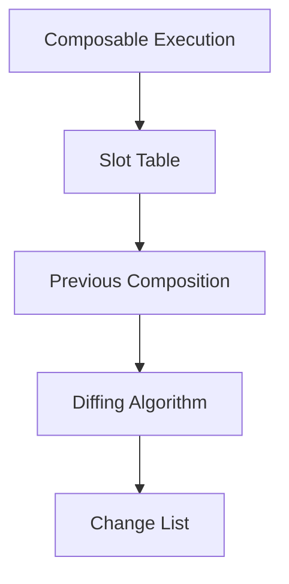
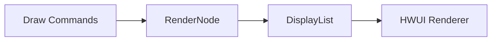

# Compose编译到显示的流程解析
Jetpack Compose 是 Google 推出的用于构建原生 Android UI 的现代声明式框架，它简化了 Android 应用的 UI 开发过程。

将XMl+Java的开发方式转变为Kotlin语法的Compose的开发方式，让开发者可以使用更简洁、更直观的代码来构建用户界面，开发体验上极致的统一。

那么一个 `@Composable` 方法是如何变成屏幕上的显示内容的呢？下面从Android平台为切入点，从编译阶段到运行时阶段，详细解析 `Compose` 的显示流程。再看看`Compose Multiplatform`这个跨平台框架和 `Android` 平台上的原型`Jetpack Compose`有何异同。

## 回顾下View架构显示流程
我们的应用要加载一个显示界面时，会经历以下几个阶段。首先将xml的布局文件，按照内部的父控件子控件的包含关系，将它们解析成View树，然后将View树交给WindowManager进行显示。

View的测量布局渲染三大步走完后，将要显示的内容，显示到ViewRootImpl中创建的Canvas画布上。

## Compose编译阶段

大纲从编译到运行显示，细节学习文章：[juejin](https://juejin.cn/post/6966241418046078983)

### 1. Composable 函数的转换

当编译器遇到 `@Composable` 注解时，会进行特殊处理：

- **函数重组**：编译器将 Composable 函数转换为可重组的结构
- **插入代码生成**：自动生成调用位置记忆、差异比较等逻辑
- **参数处理**：将参数转换为可追踪的状态

```kotlin
// 你写的代码
@Composable
fun Greeting(name: String) {
    Text("Hello $name")
}

// 编译器生成的近似结构（概念性表示）
fun Greeting(
    composer: Composer,
    key: Int,
    name: String
) {
    composer.startRestartGroup(key)
    if (name != composer.changed(name)) {
        composer.recordMutableState(name)
    }
    Text(composer, 123, "Hello $name")
    composer.endRestartGroup()?.updateScope { ... }
}
```

### 2. 构建 Gap Buffer 结构

Compose 编译器会生成一种称为 "Gap Buffer" 的数据结构：
- 存储 UI 树的当前状态
- 高效处理局部更新
- 通过插槽表(Slot Table)管理组件位置

## 二、运行时阶段

### 1. 组合(Composition)过程

当首次运行或状态变化时：

1. **执行 Composable 函数**：生成 UI 描述树
2. **构建 Slot Table**：记录所有组件的层次结构和状态
3. **差异比较**：与上一次组合结果进行比较（类似 Virtual DOM diffing）



### 2. 布局(Layout)阶段

1. **测量(Measure)**：确定每个节点的大小
2. **放置(Placement)**：确定每个节点的位置
3. **布局树构建**：基于约束条件计算最终布局

```kotlin
// 底层布局过程概念
fun Layout(
    content: @Composable () -> Unit,
    modifier: Modifier = Modifier,
    measurePolicy: MeasurePolicy
) {
    val measurables = rememberMeasureables(content)
    val placeables = measurables.map { it.measure(constraints) }
    layout(width, height) {
        placeables.forEach { it.place(x, y) }
    }
}
```

### 3. 绘制(Drawing)阶段

1. **Canvas 操作转换**：将 Compose 绘图指令转换为 Android Canvas 操作
2. **渲染节点构建**：构建 RenderNode 树
3. **硬件加速**：利用 Android 的硬件加速渲染管道



## 三、关键优化技术

### 1. 智能重组(Recomposition)

- **位置记忆**：通过编译器生成的 key 识别组件
- **范围限定更新**：只更新受影响的部分子树
- **跳过优化**：当输入未变化时完全跳过执行

### 2. 状态追踪系统

```kotlin
val count by remember { mutableStateOf(0) }
// 编译器转换为类似：
val count = remember {
    SnapshotStateMutable(0).also { 
        composer.recordMutableState(it) 
    }
}
```

### 3. 渲染优化

- **绘制缓存**：重复使用不变的绘制内容
- **图层分离**：自动处理需要单独硬件层的元素
- **无效区域处理**：只重绘屏幕的脏区域

## 四、与传统 View 系统的对比

| 特性                | View 系统               | Jetpack Compose          |
|---------------------|-------------------------|--------------------------|
| **UI 构建方式**      | 命令式                  | 声明式                   |
| **更新机制**         | 手动调用 invalidate()   | 自动追踪状态变化         |
| **视图层次**         | 持久的 View 对象树      | 临时的组合描述树         |
| **性能优化**         | 手动优化                | 自动优化                 |
| **测量/布局**        | 多次测量可能            | 单次测量保证             |

这种底层设计使得 Compose 能够高效地将声明式代码转换为屏幕上的像素，同时保持流畅的性能和灵活的开发体验。