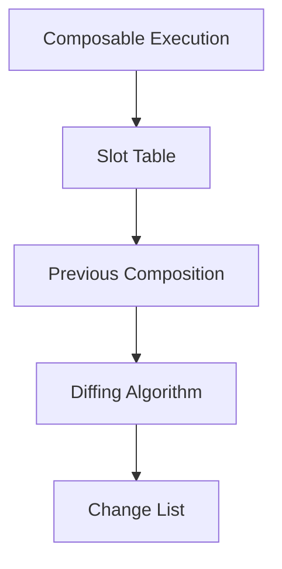
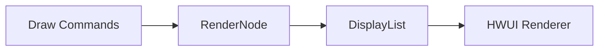

# Compose编译到显示的流程解析
Jetpack Compose 是 Google 推出的用于构建原生 Android UI 的现代声明式框架，它简化了 Android 应用的 UI 开发过程。

将XMl+Java的开发方式转变为Kotlin语法的Compose的开发方式，让开发者可以使用更简洁、更直观的代码来构建用户界面，开发体验上极致的统一。

那么一个 `@Composable` 方法是如何变成屏幕上的显示内容的呢？下面从Android平台为切入点，从编译阶段到运行时阶段，详细解析 `Compose` 的显示流程。再看看`Compose Multiplatform`这个跨平台框架和 `Android` 平台上的原型`Jetpack Compose`有何异同。

## 回顾View架构
我们的应用要加载一个显示界面时，会经历以下几个阶段。首先将xml的布局文件，按照内部的父控件子控件的包含关系，将它们解析成View树，然后将View树交给WindowManager进行显示。

具体的：

### 1. xml文件解析构建View树
当调用 `setContentView(R.layout.xxx)` 或 `LayoutInflater.inflate()` 时，系统会通过 `LayoutInflater` 解析 XML 文件。

使用 `XmlPullParser` 逐行解析 XML 标签，转换为内存中的视图对象（如 TextView、LinearLayout 等）。

根据标签属性（如 android:text、android:layout_width）设置视图的初始参数。

解析后的 XML 会生成一个对应的 视图树（View Hierarchy），根节点是顶层布局（如 ConstraintLayout），子节点是嵌套的视图。

每个视图的构造函数会被调用，并通过 `AttributeSet` 读取 XML 中的属性值（如 textSize、background）。

### 2. 测量(Measure)
`onMeasure(int widthMeasureSpec, int heightMeasureSpec)` ，父视图通过 MeasureSpec 向子视图传递尺寸约束（如 match_parent、wrap_content 或固定值）。

视图根据约束计算自身尺寸（可能需要多次测量，尤其是嵌套布局）。

最终通过 `setMeasuredDimension()` 保存测量结果。

### 3. 布局(Layout)
`onLayout(boolean changed, int l, int t, int r, int b)` ，父视图根据测量结果确定子视图的位置（左上右下坐标）。

例如：LinearLayout 会按垂直/水平方向依次排列子视图。

### 4. 绘制(Draw)
`onDraw(Canvas canvas)` ，视图通过 Canvas 和 Paint 绘制自身内容（如文本、背景、边框）。

绘制顺序：背景 → 主体内容（如文本/图片） → 子视图 → 前景（如滚动条）。

支持硬件加速时，绘制指令会转为 RenderNode 并交由 GPU 处理。

### 5. 合成送显
`SurfaceFlinger` 合成。各层的绘制结果（Surface）由 SurfaceFlinger 合成为最终帧。提交到屏幕时，通过 VSync 信号同步，将帧数据发送到屏幕缓冲区显示。

一般View架构的应用，在做布局相关性能优化时，有如下手段：

> 减少布局层级：避免嵌套过深，用 ConstraintLayout 替代多层 LinearLayout。

> 避免过度绘制：通过 onDraw() 优化或设置 android:background=null。

> 使用 ViewStub：延迟加载复杂但非立即显示的布局。

## Compose架构
### 前言 Gap Buffer
Gap Buffer 是一种用于优化局部更新的高效数据结构，它通过在数组中预留一个空白区域（Gap）来实现高效的插入和删除操作。


**补齐介绍**


### 前言 Slot Table
#### **数据结构描述**
SlotTable 是 Compose 里的内部数据结构，用于跟踪 **组合层次结构** 中的视图数据，包括 **节点、组、键和记忆值** 。这个数据结构上的各个组的结构及其值由编译器决定，并在运行时随着层次结构和应用状态的建立和更新而变化。

SlotTable 是一个 **树形结构** ，其中每个节点都是一个组，且内部可能有子项。其每个元素被称作“插槽（Slot）”。每个插槽能存储特定类型的数据，像组件的类型、属性、状态等信息。它以扁平化的方式存储 UI 树的信息，取代了传统的树形结构，从而简化了 UI 的管理与更新操作。

组（Groups）包含以下信息：
1. **键**： 用于区分组的识别符，通过快速识别组的变化来帮助重新组合。它不需要是唯一的。
2. **标志**： 有关分组的元数据，包括分组所含节点数的计数器。
3. **槽**： 为组存储的值的有序列表，可以修改或删除。槽支持引用类型和基元，可独立跟踪以避免自动排序惩罚。实用槽由槽表管理，其他槽则由金豪编译器生成，跟踪记忆值和可编译函数参数。

还有以下的可选属性：
1. **节点**：与组相关联的节点，由 Applier 使用。Composer 通过 SlotTable 在内部维护这些节点。
2. **对象键**：补充标准整数键的可选键。
3. **辅助值***：与节点相关联的辅助数据值，设置与组的其他槽无关。它用于记录 CompositionLocal 地图。

SlotTable 的实现是一个基于页面的链接表，它将组信息编码成整数，并将其打包成数组，以避免额外的分配。组内部维护了 **几个指针** 指向其父组、第一个子组和下一个同级组的指针，编码为指向页面的地址和页面内的索引。

该数据结构返回和使用的所有 GroupAddresses 都是稳定的。一旦分配，地址将不会改变，除非将组删除并重新添加到表中。

一个 SlotTable 可以与另一个 SlotTable 共享地址空间，这样就可以通过指针重新分配而不是内存复制，在表之间有效地移动组。

#### **工作流程**
**1. 组合阶段**
在首次运行或状态改变时，Composable 函数会被执行，生成 UI 描述树。此时，Composer 会遍历这个 UI 描述树，把相关信息写入 Slot Table。例如，可组合函数实现的起始与结尾通过 Composer.startRestartGroup() 与 Composer.endRestartGroup() 在 Slot Table 中创建 Group，以此来表示 UI 树的层次结构。

**2. 差异比较阶段**
当状态发生变化需要重组时，Composer 会将新生成的 UI 描述树与 Slot Table 里存储的上一次组合结果进行比较，类似 Virtual DOM diffing。通过比较，找出需要更新的部分，生成一个变更列表（Change List）。

**3. 更新阶段**
依据变更列表，Composer 对 Slot Table 进行更新，仅修改那些发生变化的插槽，而不改变未变化的部分。这种局部更新的方式提升了 UI 更新的效率。

**优势**
1. 高效的局部更新
Slot Table 能高效处理局部更新，仅更新受状态变化影响的部分，避免了对整个 UI 树的重新构建和渲染，从而显著提升性能。

2. 简化树结构管理
采用线性数组结构，把树形结构的 UI 信息扁平化存储，降低了树结构管理的复杂度，提升了访问和修改的效率。

3. 状态追踪
Slot Table 可以记录组件的状态信息，方便 Composer 在重组时追踪状态变化，确保 UI 与数据的一致性。

**与 Gap Buffer 的关系**
Compose 编译器会生成一种称为 "Gap Buffer" 的数据结构，它与 Slot Table 紧密相关。Gap Buffer 用于存储 UI 树的当前状态，通过 Slot Table 管理组件位置，进一步优化局部更新的性能。Gap Buffer 可以在数组中预留一段空白区域（Gap），当需要插入或删除元素时，只需移动 Gap 的位置，而无需移动大量元素，从而提升操作效率。

### 1. Composable 函数的转换
我们编写界面UI时，使用的可组合项都会添加一个 `@Composable` 注解，被 @Composable 所注解的函数称为 `可组合函数` 。

添加该注解的函数会被真实地改变类型，改变方式与 suspend 类似，在编译期进行处理，只不过 Compose 并非语言特性，无法采用语言关键字的形式进行实现。

示例：
```kotlin
@Composable
fun Greeting(name: String) {
    Text("Hello $name")
}

// 编译器生成的近似结构（概念性表示）
fun Greeting(name: String, parentComposer: Composer, changed: Int) {
    val composer = parentComposer.startRestartGroup(GROUP_HASH)

    val dirty = calculateState(changed)
    
    if (stateHasChanged(dirty) || composer.skipping) {
        Text("Hello $name", composer = composer, changed = ...)
    } else {
        composer.skipToGroupEnd()
    }

    composer.endRestartGroup()?.updateScope {
        Greeting(name, changed)
    }
}
```

可见被 `@Composable` 注解后，函数增添了额外的参数，其中的 `Composer` 类型参数 **作为运行环境** 贯穿在整个可组合函数调用链中，所以可组合函数无法在普通函数中调用，因为 **不包含相应的环境** 。

可组合函数实现的起始与结尾通过 `Composer.startRestartGroup()` 与 `Composer.endRestartGroup()` 在 Slot Table 中创建 Group，而可组合函数内部所调用的可组合函数在两个调用之间创建新的 Group，从而 **在 Slot Table 内部完成视图树的构建** 。

Composer 根据当前是否正在修改视图树而确定这些调用的实现类型。

在视图树构建完成后，若数据更新导致部分视图需要刷新，此时非刷新部分对应可组合函数的调用就不再是进行视图树的构建，而是视图树的访问，正如代码中的 `Composer.skipToGroupEnd()` 调用，表示在访问过程中直接跳到当前 Group 的末端。

Composer 对 Slot Table 的操作是读写分离的，只有写操作完成后才将所有写入内容更新到 Slot Table 中。

除此之外，可组合函数还将通过 **传入标记参数的位运算** 判断内部的可组合函数执行或跳过，这可以 **避免访问无需更新的节点** ，提升执行效率。

### 2. 构建 Gap Buffer 结构

Compose 编译器会生成一种称为 "Gap Buffer" 的数据结构：
- 存储 UI 树的当前状态
- 高效处理局部更新
- 通过插槽表(Slot Table)管理组件位置

## 二、运行时阶段

### 1. 组合(Composition)过程

当首次运行或状态变化时：

1. **执行 Composable 函数**：生成 UI 描述树
2. **构建 Slot Table**：记录所有组件的层次结构和状态
3. **差异比较**：与上一次组合结果进行比较（类似 Virtual DOM diffing）



### 2. 布局(Layout)阶段

1. **测量(Measure)**：确定每个节点的大小
2. **放置(Placement)**：确定每个节点的位置
3. **布局树构建**：基于约束条件计算最终布局

```kotlin
// 底层布局过程概念
fun Layout(
    content: @Composable () -> Unit,
    modifier: Modifier = Modifier,
    measurePolicy: MeasurePolicy
) {
    val measurables = rememberMeasureables(content)
    val placeables = measurables.map { it.measure(constraints) }
    layout(width, height) {
        placeables.forEach { it.place(x, y) }
    }
}
```

### 3. 绘制(Drawing)阶段

1. **Canvas 操作转换**：将 Compose 绘图指令转换为 Android Canvas 操作
2. **渲染节点构建**：构建 RenderNode 树
3. **硬件加速**：利用 Android 的硬件加速渲染管道



## 三、关键优化技术

### 1. 智能重组(Recomposition)

- **位置记忆**：通过编译器生成的 key 识别组件
- **范围限定更新**：只更新受影响的部分子树
- **跳过优化**：当输入未变化时完全跳过执行

### 2. 状态追踪系统

```kotlin
val count by remember { mutableStateOf(0) }
// 编译器转换为类似：
val count = remember {
    SnapshotStateMutable(0).also { 
        composer.recordMutableState(it) 
    }
}
```

### 3. 渲染优化

- **绘制缓存**：重复使用不变的绘制内容
- **图层分离**：自动处理需要单独硬件层的元素
- **无效区域处理**：只重绘屏幕的脏区域

## 四、与传统 View 系统的对比

| 特性                | View 系统               | Jetpack Compose          |
|---------------------|-------------------------|--------------------------|
| **UI 构建方式**      | 命令式                  | 声明式                   |
| **更新机制**         | 手动调用 invalidate()   | 自动追踪状态变化         |
| **视图层次**         | 持久的 View 对象树      | 临时的组合描述树         |
| **性能优化**         | 手动优化                | 自动优化                 |
| **测量/布局**        | 多次测量可能            | 单次测量保证             |

这种底层设计使得 Compose 能够高效地将声明式代码转换为屏幕上的像素，同时保持流畅的性能和灵活的开发体验。